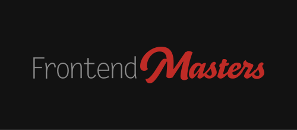

*Hello, and welcome to the Intro to Next.js course!*

## Who Are You
> 💡 **TLDR**: You know some React

This course is for anyone who wants to get up to speed with Next.js. You can be a React pro or have just finished your first todo app in React. 

Some, but not much, React knowledge is recommended to get the best from this course. This means that you know your way around JavaScript and the Browser as well.

This course will also cover a decent amount of JAMstack practices and techniques. On that point, much of that knowledge can be transferred over to other frameworks.

## What You Can Expect
This class's goal is to walk away with the ability to create an app using Next.js and have a great foundation to learn more advanced topics.

## Contributing
Find a typo or error? This course is open-source; make a [Pull Request](https://github.com/Hendrixer/nextjs-course)!

## Who Am I

My name is Scott Moss. I'm the CEO and co-founder of [Tipe](https://tipe.io). When it comes to code, I'm a product person. I love building and thinking about creating incredible experiences for users. Before Tipe, I did consult for companies like Bloomberg, Visa, and American Airlines.

Outside of code, I'm all over the place. Really big into fitness, especially yoga, basketball, and calisthenics. I'm a rare sneaker collector that spends too much time looking for the next pair. Recently, I've gotten into building custom gaming PC's, and I'm pretty addicted. I just don't make them, I play too, mostly FPS like Call of Duty, Overwatch, and Destiny 2. I currently live in Sacramento, CA, with my growing family. I'm originally from Atlanta, but joining the Navy brought me to Cali, and since then, I have lived in San Diego, LA, Oakland, and San Francisco. My favorite things to watch are anime and standup, don't sleep on it!

## Special Thanks to [Frontend Masters](https://frontendmasters.com)
> They really are the best 💯

